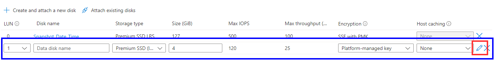
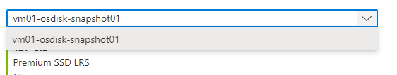
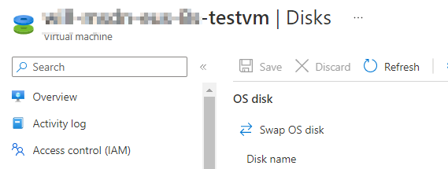
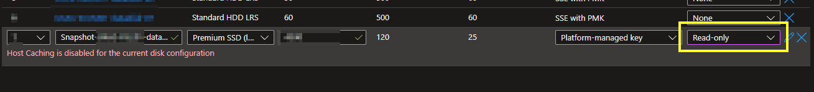

## Document Control

- Created: x
- Last Updated: 23/04/22

:::info 
This doc is for file level restores, this differs from a VM level restore.
:::

## Create a new disk from a Snapshot

:::tip Validate the Snapshot
Make sure to check the SnapShot is valid before starting this process.
:::

I'm assuming that there's already a Snapshot ready to go.

1. **Open** the Azure portal, https://portal.azure.com.
2. **Navigate to a VM** that is available to have a disk attached to it.
3. **Click** on Disks on the left-hand side.
4. **Create** a new disk.
5. 
6. **Click Edit** on the far right hand side. As shown in red above.
7. **Name your Disk**, I'd suggest, snapshot_ServerName_Date_Time
8. Source, **Select snapshot**.
9.  **Select the Snapshot** you wish to attach.
10. 
11. Make any changes to the Encryption Type.
12. I'd suggest it **not** to be a shared disk.
13. **Press Save**.
14. 

This shouldn't take too long.

## Error "Host Caching is disabled..."

If you see the error below, change the Host Caching option to "none".

## Confirm disk is visibile in the OS

:::tip
The share should be available from the get go however, you may need to bring the disk online within computer management.
:::

1. **RDP into your VM** & check File Explorer for your disk, the name will be what the share was called originally.
2. **Open** Computer Management, **Click Disk Management**.
3. **Right-Click** on the disk, **mark it as Oneline**.

You should now see it in File Explorer.

## Detach the disk