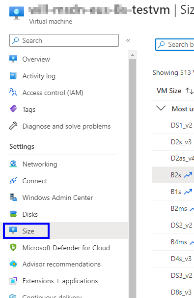

## Before you begin

- Shutdown the VM from within it's OS if possible (Not always necessary at all but, nice to do).
- If you cannot see the VM size that you're looking for it may not be compatible with your VM.

:::note
You can have too many disk or NICs attached to the VM for the size you want. The type of disks that you have attached can limit your options, premium and standard tier.
:::

## Re-sizing the vm

:::danger  De-allocating a VM can cause issues!
De-allocating the VM also releases any dynamic IP addresses assigned to the VM. The OS and data disks are not affected. 

At the same time, you're releasing your ownership of the size of that VM.  If you are resizing a production VM, consider using Azure Capacity Reservations to reserve Compute capacity in the region; otherwise you may have to pick another size.
:::

1. **Open** the Azure portal, https://portal.azure.com.
2. **Search** for your virtual machine.
3. 
4. In the left menu, **Select Size**.
5. 
6. **Choose the new size** from the list of available sizes and then **Select Resize**.
