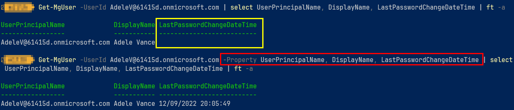

## Document Control

- Created: 2023/04/22
- Last Updated: 2023/04/22

## Module Management

### Permissions Scopes

MG Graph uses permissions scopes that you assign at logon, use the command below to locate what permissions scopes you need for your logged in session.

```powershell showLineNumbers
Find-MgGraphCommand -command Get-MgUser | Select -First 1 -ExpandProperty Permissions
```

### Connect & Update

```powershell showLineNumbers
Connect-MGGraph
Update-Module -Name Microsoft.Graph
```
 
### Connect to MG Graph with Read-only permissions

Connect-MGGraph

This will connect with read only permissions to manage Users and Devices.

```powershell showLineNumbers
Connect-MgGraph "User.Read.All", "Calendars.Read.Shared", "DeviceManagementRBAC.Read.All", "DeviceManagementServiceConfig.Read.All", "DeviceManagementConfiguration.Read.All", "DeviceManagementManagedDevices.Read.All" 
```

## Getting properties from commands

Getting properties using MGGraph requires "declaring" them as part of the original command, if you don't so this they will be blank in the following commands or pipe. For example, `get-mguser -userid username@domain.com | select UserPrincipalName, DisplayName, LastPasswordChangeDateTime` will return the UPn & display name but, `LastPasswordChangeDateTime` will be blank. 

You would need to type the command in this format, `get-mguser -userid username@domain.com -property -Property UserPrincipalName, DisplayName, LastPasswordChangeDateTime | select UserPrincipalName, DisplayName, LastPasswordChangeDateTime`.



## User Management

### Grab basic user information to work with

```powershell showLineNumbers
$userReport = Get-MgUser -All -property DisplayName, UserPrincipalName, AssignedLicenses, businessphones, CompanyName, CreatedDateTime, Id, jobTitle, LastPasswordChangeDateTime, MobilePhone, Manager, Usertype | `
Select DisplayName, UserPrincipalName, AssignedLicenses, businessphones, CompanyName, CreatedDateTime, Id, jobTitle, LastPasswordChangeDateTime, MobilePhone, Manager, Usertype
```

### Grab a password report of all users.

```powershell showLineNumbers
Get-MgUser -All -Property UserPrincipalName, DisplayName, Id, LastPasswordChangeDateTime,PasswordPolicies | `
Select-Object UserPrincipalName, DisplayName, LastPasswordChangeDateTime,PasswordPolicies, @{l='PasswordAgeDays';e={ (New-TimeSpan -Start $_.LastPasswordChangeDateTime -End (get-date) )TotalDays -as [int] }} | ` 
Sort-Object PasswordAgeDays 
 ```

## Device management

### Get devices from Intune with their Primary User

Get-MgDeviceManagementManagedDevice

```powershell showLineNumbers
# Connect with the relevant permission to read all user and device data.
Connect-MgGraph "User.Read.All", "DeviceManagementRBAC.Read.All", "DeviceManagementServiceConfig.Read.All", "DeviceManagementConfiguration.Read.All", "DeviceManagementManagedDevices.Read.All"
 
$getAllDevices = Get-MgDeviceManagementManagedDevice -All | `
Select DeviceName, UserPrincipalName, EnrolledDateTime, ComplianceState, IsEncrypted, LastSyncDateTime, Id , Manufacturer, Model, OperatingSystem, OSVersion, SerialNumber,@{l='PrimaryUser';e={  $device = $_ ; Get-MgDeviceManagementManagedDeviceUser -ManagedDeviceId $device.id | select -expandproperty UserPrincipalName  }} | `
Sort OperatingSystem
```

### Get Generic Device Report from intune

```powershell showLineNumbers
# Connect with the relevant permission to read all user and device data.
Connect-MgGraph "User.Read.All", "DeviceManagementRBAC.Read.All", "DeviceManagementServiceConfig.Read.All", "DeviceManagementConfiguration.Read.All", "DeviceManagementManagedDevices.Read.All"
 
# Get all intune "Managed" devices.
Get-MgDeviceManagementManagedDevice -All | select DeviceName, AzureAdDeviceId, UserPrincipalName, Id, ComplianceState, EnrolledDateTime, LastSyncDateTime, Manufacturer, Model, OSVersion, SerialNumber | sort UserPrincipalName |  ft -AutoSize
```

### Get a list of Configuration Profiles from Intune

Get-MgDeviceManagementDeviceConfiguration

```powershell showLineNumbers
# Get Configuration Profiles for an Org.
Get-MgDeviceManagementDeviceConfiguration -All | select Id, DisplayName
```

### Get a list of Compliance policies from Intune

Get-MgDeviceManagementDeviceCompliancePolicy

```powershell showLineNumbers
# Get Compliance policies for an Org.
Get-MgDeviceManagementDeviceCompliancePolicy -All | Select Displayname,LastModifiedDateTime, Id
```

#### Get a compliancy report for a compliance policy

Get-MgDeviceManagementDeviceCompliancePolicyDeviceStatuses

```powershell showLineNumbers
# Get Compliancy report for a policy
Get-MgDeviceManagementDeviceCompliancePolicyDeviceStatuses -DeviceCompliancePolicyId 6ac10074-0704-46d1-8fe2-04fa03d413d4 | Select DeviceDisplayName, Status, UserName
```

#### Get a compliance policy report for a single device

Get-MgDeviceManagementManagedDeviceCompliancePolicyState

```powershell showLineNumbers
# Device Compliancy for a single device.
Get-MgDeviceManagementManagedDeviceCompliancePolicyState -ManagedDeviceId f2c1e6c3-9330-41c9-9a91-50302c20655d
````
