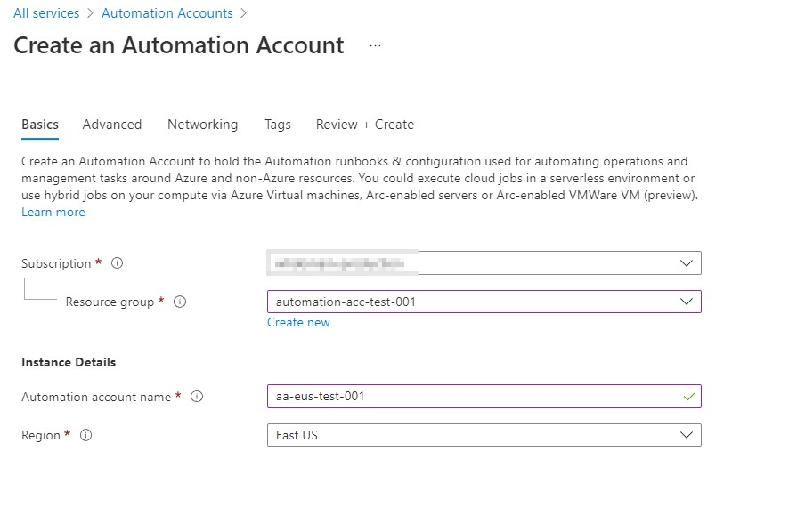
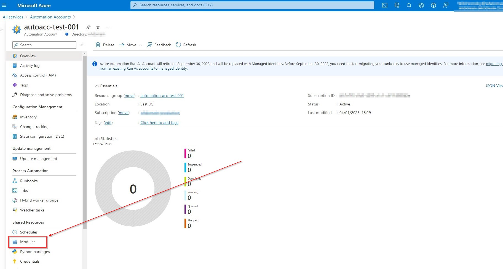

:::danger Run As accounts deprecation
Run As accounts are being deprecated, managed identities are replacing this.
:::


## Outline

1. Setup the Resource Group and Automation Account.
2. Setup the Identity for the Automation Account, this is key to running scripts gainst Azure Active Directoy and Office 365 resources. 
3. Create ourselves a Runbook, that sits inside the Automation Account. 
4. Install the relevant modules for the code we want to run.
5. Write ourselves a little script. 
6. Setup a schedule for the Runbook.

## Setup the Resource Group and Automation Account.

1. Navigate to the Azure portal.
2. **Search** for Automation Account in the search bar.
3. Select the **Automation Account** option, **Click create** in the middle of the screen **or Click +Add** in the top left.
4. Fill in the necessary information.
   1. Resource Group Name (Create one if needs be).
   2. Name.
   3. Region
   4. 

:::caution
Make sure you Select the same region as the resources you want to query, if the account is to query something else, like Azure AD or Office 365, the region is not so important.
:::

5. Select the **Advanced tab** and Select the best option for you.
   1. **System assigned**, is attached to the automation account it lives and dies with the automation account resource.
   2. **User assigned**, is one you setup yourself in Azure AD and can be used by multiple resources and is completely seperate to your automation account.
   3. 
6. Click **Review + Create** to setup the resource.

:::tip
You'll need to assign Azure ADroles and App Permissions to the System or User managed Identity, Microsoft have decided not to make this easy and it needs to be done via command line.
:::

## Apply permissions to Managed(System assigned) Identity

You'll need to apply the permissions to the Managed Identity using PowerShell unfortunatly, a Microsoft seem to have decided to make this difficult for us!

- [Reference for where this came from](https://aztoso.com/security/microsoft-graph-permissions-managed-identity/.)
- [Microsoft reference for command](https://learn.microsoft.com/en-us/powershell/module/azuread/new-azureadserviceapproleassignment?view=azureadps-2.0).

:::caution Role names
You'll need to find the correct role\permission name that you want to assign using the script below. [Try this Microsoft doc for the Microosft Graph API permissions](https://learn.microsoft.com/en-us/graph/api/overview?view=graph-rest-1.0).
:::

## The command

The below is a script you can run but, you can run it line by line to see what is going on if that's more comfortable. The general gist is that you are applying the permissions from the Microsoft Graph App to your Managed Identity.

:::tip
This same idea works for any of the Microsoft applications, each serivce has an application that is registered in your tenant. You can apply roles from any of them in theory.
:::

```powershell

# Your tenant id.
$TenantID="Add your tenant ID"
# Microsoft Graph App ID (DON'T CHANGE).
$GraphAppId = "00000003-0000-0000-c000-000000000000"
# Name of the manage identity (same as the Logic App name).
$DisplayNameOfMSI="Add display name of Enterprise App" 
# Check the Microsoft Graph documentation for the permission you need for the operation.
$PermissionName = "Add your permission here" 

# Install the module (You need admin on the machine)
Install-Module AzureAD 

# Connect to Azure AD via tenant ID, you'll need an admin account to login with though.
Connect-AzureAD -TenantId $TenantID
# Collects the Target System Managed Identities information into the MSI variable.
$MSI = (Get-AzureADServicePrincipal -Filter "displayName eq '$DisplayNameOfMSI'")
Start-Sleep -Seconds 10
# Store the Microsoft Graph API informaiton into the GraphServicePrincipal variable.
$GraphServicePrincipal = Get-AzureADServicePrincipal -Filter "appId eq '$GraphAppId'"
# Searches Microsoft Graph API for the value matching the PermissionName variable populated above and stores this in the AppRole Variable.
$AppRole = $GraphServicePrincipal.AppRoles |  Where-Object {$_.Value -eq $PermissionName -and $_.AllowedMemberTypes -contains "Application"}
# Assigned the permission from the Microsoft Graph API to the target Managed Identity.
New-AzureADServiceAppRoleAssignment -ObjectId $MSI.ObjectId -ResourceId $GraphServicePrincipal.ObjectId -Id $appRole.Id -PrincipalId $MSI.ObjectId
```
Annotated the hell out of it as the command really confused me.

:::tip Heads up!
- It takes a few minutes for this change to show in the GUI.
- If the permission already exists the prompt will error on the final command.
:::

## Setup Automation Runbook

1. Sign in to the Azure portal.
2. **Search for** and Select **Automation Accounts**.
3. On the Automation Accounts page, **Select your Automation account** from the list.
4. From the Automation account, **Select Runbooks** under Process Automation to open the list of runbooks.
5. **Click Create** a runbook and fill in the information below.
   1. Name .
   2. Select its type.
   3. Select the Runtime version
   4.  Enter applicable Description
6.  Click Create to create the runbook.

## Install any Modules

1. Sign in to the Azure portal.
2. **Search for** and Select **Automation Accounts**.
3. On the Automation Accounts page, **Select your Automation account** from the list.
4. From the Automation account, **Select Modules** under Shared Resources.
   1. 
5. In here you can see a list of currently installed modules and you can add more by Clicking on the +Add a module button.

:::tip
You may find that you have to search around a bit for the module that you do actually want and when you do find the module you want, search for the command that you want to use, sometimes the module name is right but the command is missing!

Microsoft Graph is probably the most well rounded module but, it's quite finicky to use, otherwise stick with the Az Command line.
:::

## Test Script

### Create the Script

1. Navigate to your runbook.
2. **Click Edit** at the top.
3. Here you can **enter your script**.

Useful options on the left hand side to note:
- **CMDLETS**, which you can use to find commands from the installed modules.
- **ASSETS**, which will show you the various resources available to your runbooks which are saved within your automation account resource.

### Test Script

Once your done and ready to test.
1. **Click on Test pane** at the top.
2. **Click Start** in the top left to being running the scrpt.

I found it really hard to get my head around how this works for some reason. So expect that this may take quite a few tries to get right.

:::caution Storage Account Key
Before you can use the script as a base, you'll need to store the storage account key as a variable in your Automation account.
1. Open your **Automation Account**.
2. Click on **Variables** under Shared Resources.
3. Click **Add a variable**.
4. Create a new **string variable**.

See the script for how to reference these in your runbooks.
:::

```powershell
# Ensures you do not inherit an AzContext in your runbook
Disable-AzContextAutosave -Scope Process | Out-Null

#Storage Account Information 
$StorageACCKey = Get-AutomationVariable -Name 'stgacckey01' 
$ContainerName = "Enter the blob container name"

# Connect using a Managed Service Identity
try {
    Connect-AzAccount -Identity
}
catch{
    Write-Output "Unable to login. Aborting."; 
    exit
}

$Users = Get-AzADUser | Select-Object DisplayName, Id, Mail, UserPrincipalName

Write-Output $Users

# Exports the data in the $Users variable into a local environmental variable that will store the information whilst running in the Automation account. 
$Users | Export-Csv "$Env:temp\Users.csv" -notypeinformation

# Creates a new context to enable connection to the storage account. 
$Context = New-AzureStorageContext -StorageAccountName "whautomationfiledump" -StorageAccountKey $StorageACCKey

# This copes the csv file in the $Env:temp/MFAState.csv variable and copies it to the blob. 
Set-AzureStorageBlobContent -Context $Context -Container $ContainerName -File "$Env:temp\Users.csv" -Blob "Users.csv" -force
```

:::tip In my experience
The test window is not like a command promtp and will not output the commands running or anything at all apart from really confusing errors. Try to build error catching into your script, use the `try, catch` commands to write the errors to the promtp for debugging. More in this in the testing section at the bottom.
:::

## Setup the Schedule

This has been mostly regurgitated from [this Microsoft link here.](https://learn.microsoft.com/en-us/azure/automation/shared-resources/schedules#create-a-new-schedule-in-the-azure-portal)

1. From your Automation account, on the left-hand pane **Select Schedules** under Shared Resources.
2. Select **Add a schedule**.
3. Select whether the schedule runs once or on a reoccurring schedule by Selecting Once or Recurring.
   1. If you Select Once, **specify a start time** and then **Select Create**.
   2. If you Select Recurring, **specify a start time**. For Recur every, **Select how often** you want the runbook to repeat. Select by hour, day, week, or month.
4. **Press Create** to complete.

:::tip
You must publish the runbook before you can assign the schedule to it.
:::

5. Head back to your Runbook.
6. Select **Link to schedule **at the top.
7. Click the option to **Link a schedule to your runbook**,  **Select the schedule** you created from the list.
8. **Click OK** to complete.

Example schedule below


## Testing

### Testing the script

#### Error handling

The test pane window for the most part will not output useful errors or show you how the script is running. I'd suggest building error handling and status updates into your script if you wish during debugging, it will help immensely.

An example of the `try, catch` command sytax is below.

```powershell
# Connect using a Managed Service Identity
try {
    Connect-AzAccount -Identity
}
catch{
    Write-Output "Unable to login. Aborting."; 
    exit
}
```
I'd also suggest using `write-output` all over the place to confirm progress and variables etc.

> Shout out to the VS code module for Automation Accounts, it'll let you pull down the runbook contents and edit in VsCode and upload it again.

### Confirm the data export

1. Navigate to your **storage account**.
2. Click on the **File shares or Containers option**, wherever you saved your data to.
3. Click into the share\container, **find your file** and Click on the **3 dots** to the right of it.
   1. 
4. **Click View\edit**, it should display a basic output of the file.

## Further notes

- Run As accounts are being deprecated, this method is by far the easiest to use when trying to pull info from AzureAD and Office 365.

