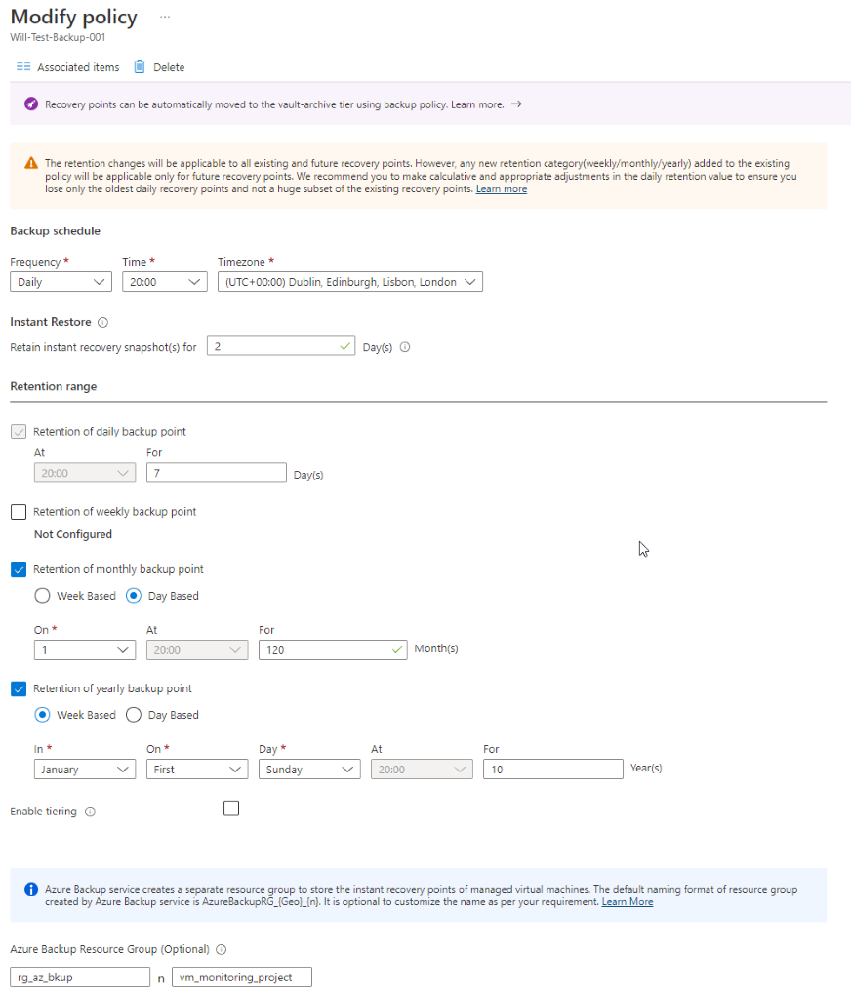

This document will run through a very basic Azure Backup setup scenario.

:::caution

This document is for setting backup policeis for Virutal Machines only. If you need to backup other resources, got to section 1.2, step 4 and select a differnet resource. 

:::

## Create the below resources in the FW-Azure Production subscription

:::info

Use whatever naming conention fits in with what's being used already, I am just suggesting something here.

:::

1. **Create the resource group**, for example, `rg-<customername>-<region>-<prod/dev>-backups-01`.
2. **Create a recovery services vault** to store the backups (GRS is the preferred option, LRS for lowest cost), for example, `rsv-<customername>-<region>-<prod/dev>-backup-01`.
3. **Create a log analytics workspace** or reuse another one, for example, `la-<customername>-<region>-<prod/dev>-backup-01`.

## Configure Backup Policy

Configure the backup policy in-line with whatever standard is being used already, my suggestions are below.

1. In the Azure portal, select a Recovery Services vault to back up the VM.
2. Under **Backup**, select **Backup Policies**.
3. Click +**Add**.
4. On **Select policy type**, select **Azure Virtual Machine**.
5. On **Create policy**, perform the following actions:

- **Policy sub type**: Standard
- **Suggested Name** format: `Bkup-policy-<time of day>-<policy type>` (example name: `bkup-policy-nightly-std`).

## Configure Alerting

:::tip

Note that this method is using the old backup alerting method, this is being replaced by Azure Monitor.

:::

[Microsoft Link for more information](https://learn.microsoft.com/en-us/azure/backup/backup-azure-monitoring-built-in-monitor?tabs=recovery-services-vaults#turning-on-azure-monitor-alerts-for-job-failure-scenarios)

Configure diagnostic logs to be sent from Azure Backup to the Log Anlytics workspace above.

1. From the **Recovery services vault** just setup. 
2. **Click on Backup Alerts**, under the Monitoring section.
3. **Click** Configure Notifications.
   1. **Enable Notifications**: Yes
   2. **Recipients(Email)**: monitoring@DomainName.com
   3. **Notify**: Hourly digest
   4. **Severity**: Critical & Warning
4. Example of this below.
5. 

## Configure Diagnostic log collection

Configure diagnostic logs to be sent from Azure Backup to the Log Anlytics workspace above.

1. **Navigate** to Diagnostic settings under Monitoring.
2. **Click** Add Diagnostic Settings.
3. **Name your diagnostic setting**, something informational, for example, "AzBkup-Diagnostics", suggestion, `Backup Report Data`.
4. **Select** Send to Log Analytics Workspace.
5. **Add a workspace** and don't touch any other settings.
6. Hit **Save**.

:::tip

Make sure to run the initial backup job from the Azure Backup Dashboard.

:::