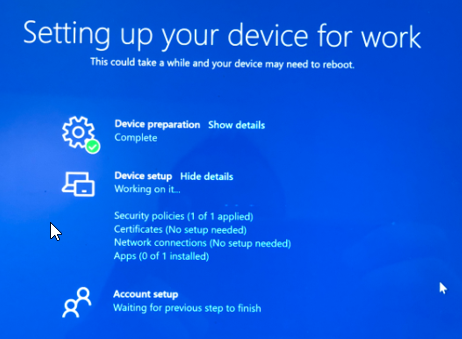

Description: Perform an AutoPilot Reset on a Windows Device.

## Before you start

:::info
Ignore this step if you know you do not use group tags.
:::

Confirm the device has the correct group tag

Sometimes group tags within Autopilot are used to assign device profiles\policies after the device has been enrolled. This group tag **must** be correct if you're using them otherwise, it'll interfer with the reset process.

1. Login to Microsoft Endpoint Manager, https://endpoint.microsoft.com/.
2. Click **Devices** > Windows > Windows Enrollment > Devices.
3. Find the **Serial number** of the device **and search it** here.
4. **Click** on **your device**, **alter** group tag** here to the correct one.
5. Click Save

:::caution
**Wait** for the profile status to change to assigned before progressing, this is automatic and in my experience can take up to 30 minutes.
:::

## Initiate the reset

:::tip
The Windows device **MUST** have a stable internet connection to complete this process.
:::

1. Login to Microsoft Endpoint Manager, https://endpoint.microsoft.com/.
2. **Click** Devices > Windows > Windows Devices, it should already be on this option.
3. **Search** for your device and **click on the device name**.
4. Click the **Autopilot Reset option**.
5. Click **Yes**.

## On the device

1. Make sure the **machine is powered on** and **connected to an internet source**.
2. The Autopilot process should start automatically.
3. When the option appears, **select Windows Autopilot provisioning**. Autopilot should take over from here and reset the device.
   1. 
   2. 

Once the above completes you should then be returned to a normal looking Windows login prompt.