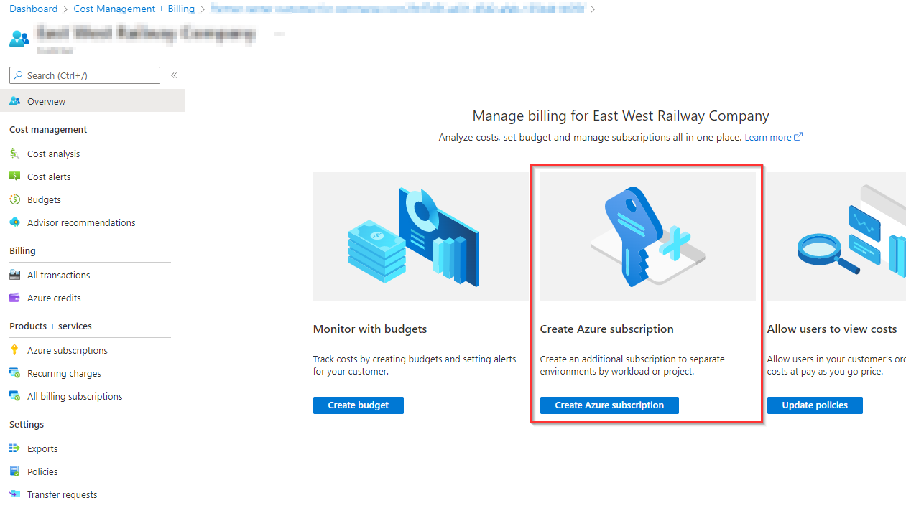
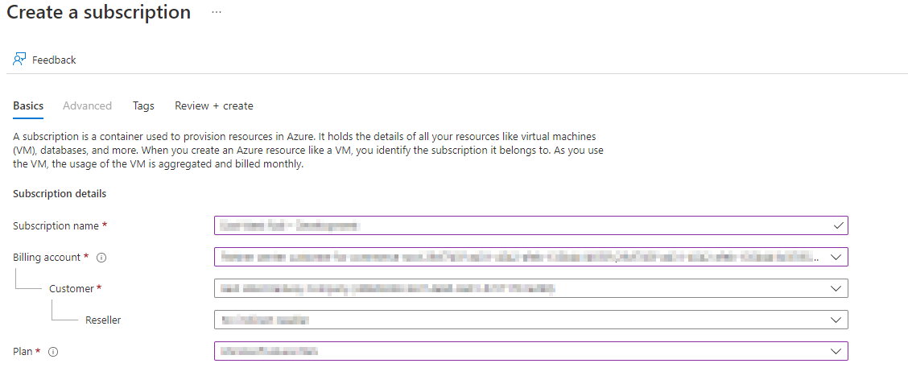

Description: Setup an Azure Subscription within Partner Centre for a customer. This has the added benefit of creating the PAL or DPOR link to earn partner credit.

## Before you begin

Who'll manage this subscription?

- If it's being setup with the CSP, it'll automatically be owned by the CSP.

Who'll be supporting this subscription?

- Will it be added to BAU.
- What Groups and\or accounts need to manage it, (Owner, Contributor, Reader).

## Setup Guidance

[Create a Subscription for Partners | Microsoft Doc Link](https://docs.microsoft.com/en-us/azure/cost-management-billing/manage/create-customer-subscription#create-a-subscription-as-a-partner-for-a-customer).

### Access the Billing Blade

1. Sign in to the **Azure portal** using your Partner Center account.
2. Make sure you are in your **Partner Center directory (tenant)**, not a customer’s tenant.
3. Navigate to **Cost Management + Billing**.
4. Select the **Billing scope** for your billing account where the customer account resides.
5. In the left menu under Billing, **select Customers**.
6. On the Customers page, **select the customer**. If you have only one customer, the selection is unavailable.
7. In the left menu, under Products + services, **select All billing subscriptions**.
8. On the Azure subscription page, select **+ Add **to create a subscription.
    

### Creating the new Subscription

1. Then **select the type of subscription** to add. For example, Usage based/ Azure subscription.
2. On the Basics tab, enter a **subscription name**.
3. Select the **partner's billing account**.
4. Select the **partner's billing profile**.
5. Select the **customer** that you're creating the subscription for and, if applicable, **select a reseller**.
6. Next to Plan, **select Microsoft Azure Plan**** for DevTest, if the subscription will be used for development or testing workloads. Otherwise, select Microsoft Azure Plan.
    
7. Optionally, select the Tags tab and then enter tag pairs for Name and Value.
8. Select **Review + create**. You should see a message stating Validation passed.
9. Verify that the subscription information is correct, then select Create. You'll see a notification that the subscription is getting created.

The customer will see the new subscription appear for them within 60 minutes, they may need to amend the subscription filter to see the new sub.

:::info User complains they do not have access
If the end user you're testing with is not in the root managemnt group, you'll need to grant them a role over the Subscription before they can see it.
:::