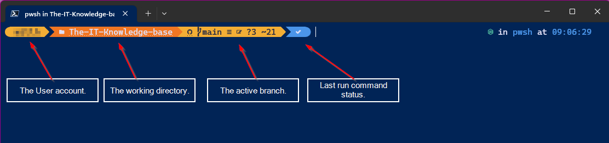
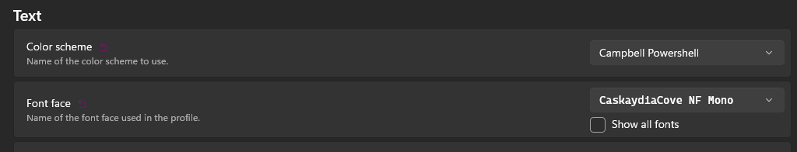

## Document Control

- Created: 06/05/23
- Last Updated: 06/05/23

## End Result



## Setup

Install the following modules: -

- PSReadLine - This tool is command history levelled up.
- OH-MY-POSH - This app will make your terminal look all fancy & provide some cool functionality.

```powershell showLineNumbers
<# You'll probably need to run terminal as admin to install these #>
winget install JanDeDobbeleer.OhMyPosh -s winget # Install the oh my posh application.
Install-Module -Name PSReadLine # Install PS ReadLine.
```

### Configure PSReadLine

You can find all of the settings to edit by running `Get-PSReadlineOption`, it will show a list. The settings below are ones that I like to change: -

```powershell showLineNumbers
Set-PSReadLineOption -PredictionViewStyle ListView # Enables a dropdown list view of previous related commands.
Set-PSReadlineOption -HistoryNoDuplicates # Stops duplicate commands being remembered.
Set-PSReadlineOption -MaximumHistoryCount 1024 # Reduces the amount of commands that are remembers.
```

## Configure Oh My Posh

:::info Original location
[ohmyposh website link for installing on Windows OS](https://ohmyposh.dev/docs/installation/windows).

MacOS and Linux is also available at this link, just change to the relevant page.
:::

Install the font that you want, I would chose Cascadia Cove, as it supports all of the nice icons that oh my posh uses.

Type the command in below, it will open a options menu within your powershell window.

```powershell showLineNumbers
oh-my-posh font install # Install fonts, will provide a dropdown selection for you.
```

### Configuring PowerShell\Terminal

To get PSReadLine and oh my posh to load at startup, you'll need to edit your PowerShell profile.

```powershell showLineNumbers
notepad $PROFILE # Will open your profile file or create one at the correct location for you to edit.
```

Add the following lines to it.

```powershell showLineNumbers
oh-my-posh init pwsh --config "$env:POSH_THEMES_PATH\jandedobbeleer.omp.json" | Invoke-Expression # This runs the oh my posh app using the specified theme.
<# You can change this by swapping out the json file target, you'll find them here, 'C:\Users\username\AppData\Local\Programs\oh-my-posh\themes'. #>
<# If you want to set PSReadLine options here you can. #>
Get-PSReadlineOption | Select-Object -expand historysavepath | Remove-Item # An example of wiping the PSReadLine History when Pwsh is started for the first time.
```
:::caution Adding to much to your $PROFILE
If you add a lot to your profile, it will affect how long it takes for PowerShell to load windows.
:::

If you're using Windows Terminal, we need to update the fonts in here too.

1. Open Terminal.
2. Open Settings > Defaults > Appearance.

Change the Font Face to CaskaydiaCove Mono or whatever font was chosen in this [section](#configure-oh-my-posh).



You should now hopefully see the icons in your terminal prompt too.