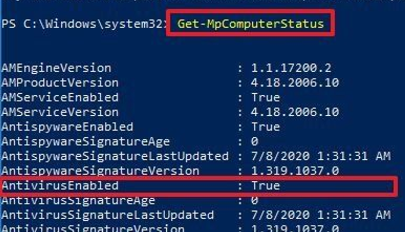
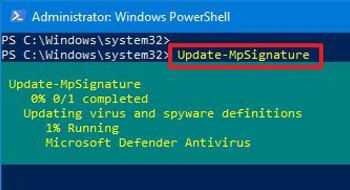
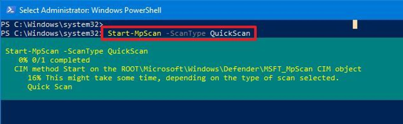

The document outlines the various options for checking the AV status on a Windows desktop device.

On Windows 10, Microsoft Defender Antivirus (formerly Windows Defender Antivirus) is part of the Windows Security experience, and it provides a robust real-time protection against unwanted viruses, ransomware, spyware, rootkits, and many other forms of malware and hackers.

## Document Control

- Created: 2023-09-20
- Last Updated: 2023-09-20

## Checking the Status

1. Click the Start button.
2. In the search bar, type PowerShell, then right-click on the top result.
3. From the context menu, select Run as administrator.
4. In the PowerShell window that opens, type the following command and press Enter:

```powershell showLineNumbers
Get-MpComputerStatus
```

Look for the **AntivirusEnabled** value, and make sure it reads `True` to confirm that the security solution is running.



## Check for AV Updates

This command will check for all types of updates, definitions and configuration changes.

1. Open PowerShell as an Administrator.
2. Type the following command to start the update process.

```powershell showLineNumbers
Update-MpSignature
```



## Running Scans using PowerShell

This section outlines how to run the different types of scans using Powershell commands, this includes Quick Scans, Full scans and Custom scans.

### Quick Scan

A quick scan is useful to do as part of troubleshooting a desktop issue (when called for, it's random to throw in for just anything).

1. Open PowerShell as an Administrator.
2. Type the following command to start the update process.

```powershell showLineNumbers
Start-MpScan -ScanType QuickScan
```



### Full Scan

A Full scan is perfect for running on a machine that has either had an alert to say that something malicious has been found or you suspect something malicious is going on with it.

:::caution Resource Consumption

Running a full scan is quite resource intensive on the endpoint, be aware it may run slowly or "hot" for a while when doing this.

:::

1. Open PowerShell as an Administrator.
2. Type the following command to start the update process.

```powershell showLineNumbers
Start-MpScan -ScanType FullScan
```

### Custom Scans

Custom scans are useful to perform a scan of a particular location, good for limiting resource consumption and time for the scan.

Example of the syntax for the commmand:

```powershell showLineNumbers
Start-MpScan -ScanType CustomScan -ScanPath PATH\TO\FOLDER-FILES
```
Example of scanning the downloads folder:

```powershell showLineNumbers
Start-MpScan -ScanType CustomScan -ScanPath "C:\Users\user\Downloads"
```
## Sheduling a Scan

Scheduling a scan is good practice for most security teams; normally though this automation is not needed and is carried out by Defender.

Example of the syntax for the command:

```powershell showLineNumbers
Set-MpPreference -ScanScheduleQuickScanTime SCAN-TIME
```

Example for setting up a daily scan at 6am (24-hour format):

```powershell showLineNumbers
Set-MpPreference -ScanScheduleQuickScanTime 06:00:00
```

:::info
To reset the scan schedule to its default settings, you can either specify no time value or set the time to two hours after midnight.
:::

## Excluding Locations

This is a necessary process for some applications to function properly, it's common to exclude fodler paths.

Example syntax for the command:

```powershell showLineNumbers
Set-MpPreference -ExclusionPath PATH\TO\FOLDER
```

Example for excluding the loction C:\Users:

```powershell showLineNumbers
Set-MpPreference -ExclusionPath C:\Users
```

## Disabling AV

This maybe needed for troubleshooting purposes, it should not be used lightly or forgotten to be re-enabled.

Although Microsoft Defender offers a command to disable the antivirus, it's guarded by the Tamper Protection feature, which you can only disable through the Virus & threat protection settings available in the Windows Security app.

```powershell showLineNumbers
Set-MpPreference -DisableRealtimeMonitoring $true
```